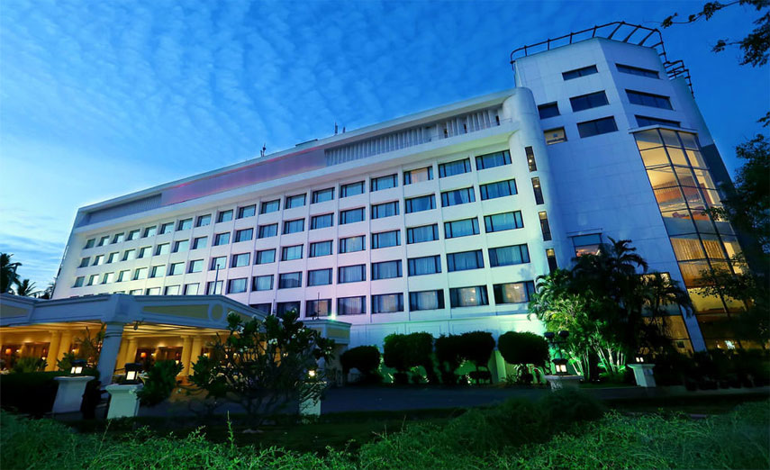
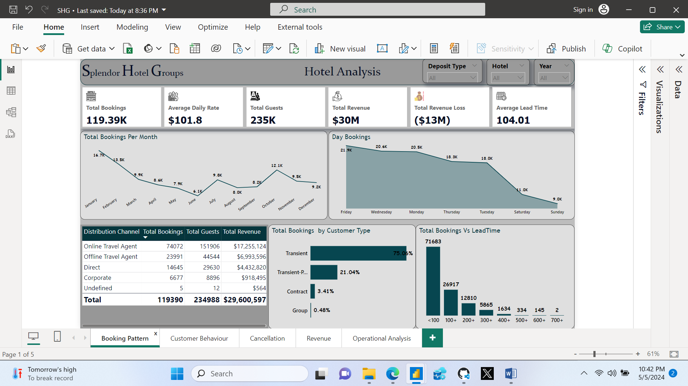
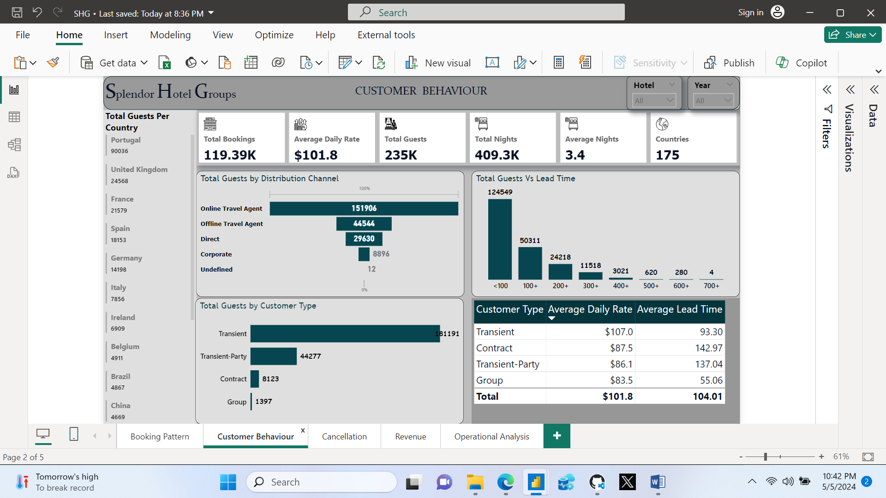
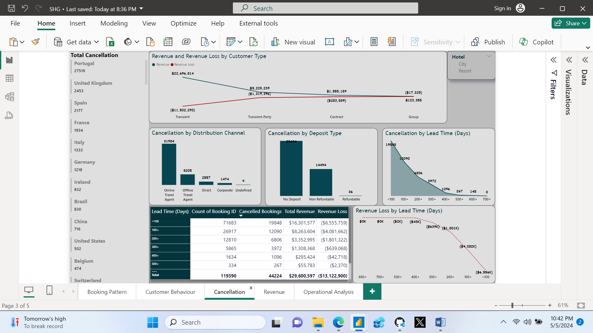
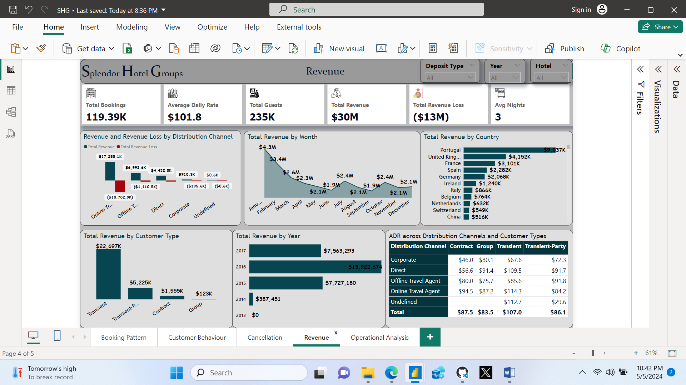
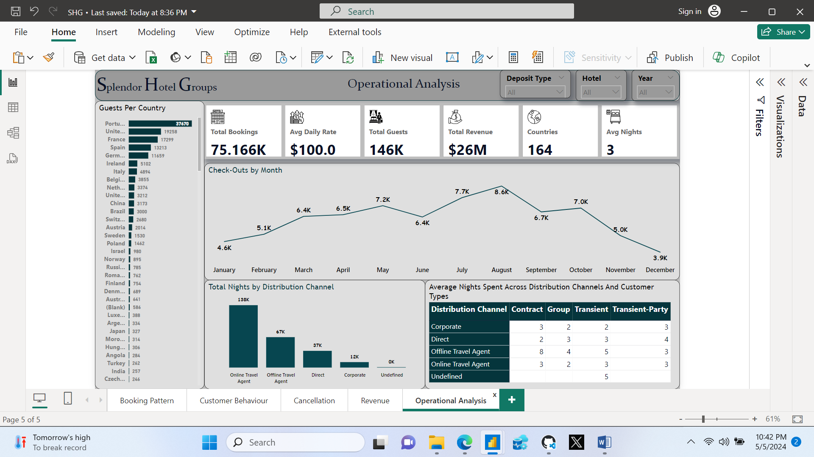

# Hotel-Analysis

## Table of Contents

- [Project Overview](#project-overview)
- [Data Source](data-source)
- [Data Analysis](data-analysis)
- [Tools](tools)
- [Recommendations](recommendations)

### Project Overview

This data analysis project aims to provide meaningful insights into the performance of an imaginary hospitality company called **Splendor Hotel Groups** over the years. By analyzing the past booking data we seek to identify trends, comprehend customer behaviour, offer useful suggestions for tactical decision-making and also exercise capabilities of Power BI.

### Data Source

Hotel Data : The primary dataset used for this analysis is the "SHG_Booking_Data.xlsx" file downloaded from a twitter account, containing detailed information about each booking made in the company.

### Tools

- Power Query - Data Cleaning.
- PowerBI - Creating report and Visualization.

### Data Cleaning/Preparation

In the data preparation phase, we performed the following tasks:
1. Data loading and inspection.
2. Data cleaning and formatting.
Using DAX, I extracted the day of the week for each booking from the booking date column and also classified the Lead Time (difference between booking date and supposed arrival date) for easier analysis.
  ```PowerBI
  Day Booking = FORMAT(Data[Booking Date], "DDDD")
  
  Lead Time (Days) = 
  IF(Data[Lead Time] >=700, "700+",
  IF(Data[Lead Time] >=600, "600+",
  IF(Data[Lead Time] >=500, "500+",
  IF(Data[Lead Time] >=400, "400+",
  IF(Data[Lead Time] >=300, "300+",
  IF(Data[Lead Time] >=200, "200+",
  IF(Data[Lead Time] >=100, "100+",
  "<100")))))))
  ```

 
  ### Exploratory Data Analysis

  EDA involved exploring the booking data to answer key questions, such as :
  - What is the trend in booking patterns over time?
  - Which distribution channels contribute the most to bookings?
  - What factors are most strongly correlated with cancellations?
  - What is the overall revenue trend?
  - How does the distribution of guests vary across different countries?
  - What is the average length of stay for guests?
  - How does the presence or absence of a deposit impact the likelihood of cancellations and revenue generation?
  - How does the time between booking and arrival date (lead time) affect revenue and the likelihood of cancellations?
  - Are there specific lead time ranges that are associated with higher customer satisfaction?
 
  ### Data Analysis

#### Booking Pattern:

The booking data spans through 2013 to 2017 with a single booking in 2013. January had the most booking activity all through, followed by February and October. For day bookings, the hotel is mostly booked on Fridays. Customers with lead time of less than 100 days had more bookings with online travel agents at the highest and the trend streams down with an increase in lead time. Lead time over 700 days had the least bookings. Transient customers had the highest bookings at 75.06% of the total bookings, leading transient-party, direct and corporate customers in that order.

#### Customer Behaviour:


According to the analysis, the average nights spent is 3 days, and a total of 119390 guests recorded. The distribution channel that contributes the most to bookings is Online Travel Agent, they also have the highest Average Daily Rate (ADR) at $108.6 followed by Direct Channel, Offline Travel Agent, Corporate channels. Of all the 175 countries of origin recorded, Portugal contributed significantly to the bookings with a total of 48590 bookings and over 90 thousand guests. This in turn means the highest revenue was gotten from Portugal customers.

#### Cancellation:


From the analysis, there is a significant difference between the number of cancellations across the deposit types. The bookings with no deposits were cancelled the most at almost 30,000 cancellation by customers while the Refundable deposit types barely had 40 cancellations. This suggests that more customers are likely to cancel their reservations when no initial commitment or deposit is made ahead of their arrival date. 
Transient customers contributed greatly to the numbers and online travel agents cancelled the most, they both recorded the highest revenue loss across customer types and distribution channels respectively. Also, customers with lead time below 100 days had the highest cancellation.

#### Revenue Optimization:


About 30 million dollars revenue was generated through the years. Customers from Portugal recorded the highest revenue generated. Transient customers tops the list of customer type suggesting that they are the major market or customer segments with an average stay of 3 nights. The ADR across the distribution channels and customer types shows the pricings are quite reasonable with minimal differences.

#### Operational Efficiency:


This is basically for customers who booked, stayed in and checked out. Check-out filter was applied on this page specifically to analyse customers that used the hotel. The average stay for guests is 3 days generally but the average for Contract customers is 6 days. For months like August with a high number of check-out dates, enough staff should be available to tend to guests and more resources should be allocated around the peak periods.
For corporate customers, more customers booked the resort and they spent an average of three nights.

### Visualization:
The report contains 5 pages:
1.	Booking Pattern
2.	Customer behavior
3.	Cancellation
4.	Revenue
5.	Operational Analysis.
You can interact with the report [here](https://app.powerbi.com/groups/me/reports/59a23049-8f52-43b2-91ee-91325463f561?experience=power-bi)

#### Conclusion and Recommendations

Based on the analysis, we recommend the following actions:

- Make the reservations non-refundable or at least 50% of the payment should be made while booking ahead of the arrival dates. This would help reduce the revenue loss across customer types and distribution channels.
- Invest in marketing, embracing diverse cultures and encouraging customers to make more reservations.
- To get more corporate customers, build or improve on making the hotel 'corporate friendly'. Availability of conference rooms for planning specific work events, easy access to all the technology required for work would help greatly.
